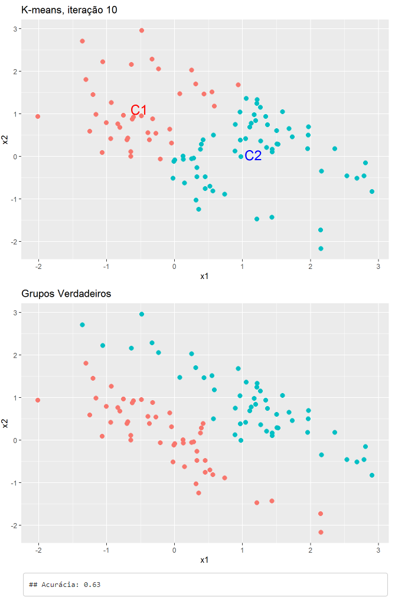
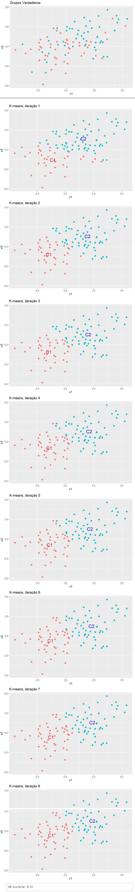
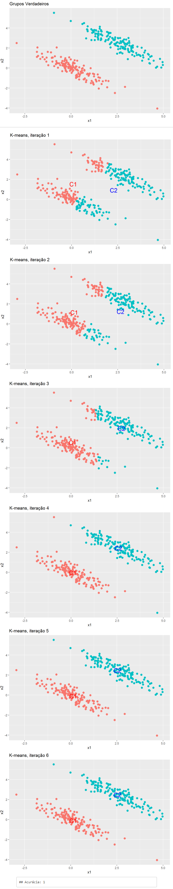

##  Análise da aplicação do K-Means em dados normais bivariados

O objetivo principal deste projeto é explorar como o K-Means, um popular algoritmo de aprendizado de máquina não supervisionado, pode ser utilizado para clusterizar conjuntos de dados de duas variáveis aleatórias que seguem uma distribuição normal bivariada. 

App desenvolvido disponível em https://ufsm.shinyapps.io/kmeans/

O K-Means é uma técnica de agrupamento (clustering) amplamente utilizada em aprendizado de máquina e análise de dados, projetada para dividir um conjunto de dados em grupos ou clusters de forma que os pontos de dados dentro de um mesmo grupo sejam mais semelhantes entre si do que com os pontos de outros grupos. Ele funciona iterativamente atribuindo pontos de dados a clusters com base na proximidade em relação a centróides (pontos médios) calculados, e ajusta esses centróides até que a convergência seja alcançada, resultando em uma divisão eficiente e não supervisionada dos dados em clusters distintos. O K-Means é amplamente aplicado em segmentação de mercado, análise de imagem, reconhecimento de padrões e muitas outras aplicações.

Em outro âmbito, a distribuição normal bivariada é útil para entender como as duas variáveis estão relacionadas e como se comportam juntas pois a descreve completamente a variabilidade de ambas as variáveis, levando em consideração suas médias, desvios padrão, bem como a covariância e a correlação entre elas. Suas principais aplicações são:

* **Risco e finanças**:  Em finanças, é crucial entender a relação conjunta entre os retornos de diferentes ativos financeiros para gerenciar portfólios de investimentos e calcular o risco associado a essas carteiras;
* **Epidemiologia**: Em estudos epidemiológicos, é comum analisar conjuntamente a exposição a fatores de risco e o desenvolvimento de uma doença, para determinar se existe uma associação entre eles;
* **Engenharia e Controle de Processos**: Para modelar conjuntamente as variáveis que afetam o desempenho ou a qualidade de um processo industrial, a fim de otimizar a produção e garantir a qualidade do produto;
* **Ciência Ambiental**: Analisar a relação entre a concentração de poluentes em diferentes locais geográficos, para entender os impactos ambientais.

Considerando que nos dados de aplicações "reais" há muito interdependência entre as variáveis há muito utilidade em realizar análises multivariadas para gerar previsões mais precisas, correlações melhores descritas e estimativas no geral. 

Para avaliar o comportamento do K-Means sob dados com distribuição normal bivariada, iremos trabalhar com duas amostras geradas aleatóriamente definidas por parâmetros de média ($\mu_1$ e $\mu_2$) e desvio padrão  ($\sigma_1$ e $\sigma_2$) e considerar cenários onde as amostras se misturam variando o vetor de médias.

Todos os cenários aqui presentes e outros podem ser setados na aplicação web: https://ufsm.shinyapps.io/kmeans/  
Adicionalmente, no app é possível verificar se os valores de variância que constituem a matriz de covariância geram uma matriz positiva definida[^1].  
[^1]: A matriz de covariância positiva definida é um pressuposto importante para que o K-Means funcione corretamente e para que os clusters gerados sejam bem definidos e tenham as propriedades esperadas. Embora o K-Means não lide diretamente com matrizes de covariância, a positividade definida da matriz é relevante porque influencia o cálculo da distância euclidiana, que é a base do algoritmo. 

***

### Função 

``` r
kmeansmanual <- function(n, mu1, mu2, Sigma, it=FALSE, semente=1){ 

  #geracao das amostras normais bivariadas
  set.seed(semente)
  xnorm1 <- mvrnorm(n,mu1,Sigma)
  xnorm2 <- mvrnorm(n,mu2,Sigma)

  amostra <- rbind(xnorm1, xnorm2)
  grupo <- cbind(amostra, c(rep(1,n),rep(2,n)))

  k<-sample(1:(n*2), n*2)
  amostra3 <- grupo[k,]

  # particao inicial
  centros <- sample(1:(n*2),2)
  centro1 <- amostra[centros[1],]
  centro2 <- amostra[centros[2],]

  tidy <- data.frame(amostra3,NA)
  colnames(tidy) <- c("x1","x2","true","estimado")

  # inicializacao do loop
  pare <- FALSE ; j=0
  while(pare == FALSE){

     # distancia euclidiana
     for(i in 1:(n*2)){
     euclidist1 <- sqrt((tidy[i,1]-centro1[1])^2 + (tidy[i,2]-centro1[2])^2) 
     euclidist2 <- sqrt((tidy[i,1]-centro2[1])^2 + (tidy[i,2]-centro2[2])^2) 
  
     # atribuicao aos clusters
     ifelse(euclidist1 < euclidist2, tidy[i,4]<-1, tidy[i,4]<-2)
     }

     c1old <- centro1
     c2old <- centro2
  
     # novos centroids
     grupo1 <- tidy[tidy$estimado==1,1:2]
     centro1 <- colMeans(grupo1)

     grupo2 <- tidy[tidy$estimado==2,1:2]
     centro2 <- colMeans(grupo2)
  
     # condicao de parada
     if(identical(c1old, centro1) & identical(c2old, centro2)) pare <- TRUE
     j <- j+1
     if(it == T){
        print(ggplot(tidy, aes(x1,x2,color=factor(estimado))) + geom_point(size=2.5) +
          annotate("text",x=centro1[1],y=centro1[2],colour="red",label="C1",size=6) +
          annotate("text",x=centro2[1],y=centro2[2],colour="blue",label="C2",size=6) +
          labs(title = paste("K-means, iteração",j)) +
          theme(legend.position="none"))
     }
  }
  if(it == F){
      print(ggplot(tidy, aes(x1,x2,color=factor(estimado))) + geom_point(size=2.5) +
        annotate("text",x=centro1[1],y=centro1[2],colour="red",label="C1",size=6) +
        annotate("text",x=centro2[1],y=centro2[2],colour="blue",label="C2",size=6) +
        labs(title = paste("K-means, iteração",j)) +
        theme(legend.position="none"))
  }
  
  print(ggplot(tidy, aes(x1,x2,color=factor(true))) +
   geom_point(size=2.5) +
   labs(title = "Grupos Verdadeiros")+
   theme(legend.position="none"))
  
   return(cat("Acurácia:",mean(tidy$true == tidy$estimado)))
}
```

### Cenário 1
``` r
kmeansmanual(n=50, mu1=c(0,0), mu2=c(1,1), Sigma=matrix(c(1,-.9,-.9,1),2))
```
<p align="center">
  
</p>

A partir do Cenário 1 é possível observar que o algoritmo k-means separa os grupos priorizando por maiores observações no eixo y para o grupo 1 e maiores valores do eixo x para o grupo 2. Como as médias das amostras normais bivariadas estão próximas, ambos centroides acabaram agrupando observações dos dois grupos.

### Cenário 2
Aumentando a variabilidade e habilitando a visualização em cada iteração do algoritmo
``` r
kmeansmanual(n=50, mu1=c(0,0), mu2=c(1,1), Sigma=matrix(c(6,2,2,3),2), it=TRUE)
```
<p align="center">
  
</p>

Neste Cenário (equivalente ao anterior exceto a matriz de covariância), adicionamos mais variabilidade para mesclar os grupos e avaliar o comportamento do algoritmo. Notamos que observações distantes do aglomerado do seu grupo foram classificadas pertencentes ao grupo alheio, como esperado, dado que o k-means classifica pela menor distância em relação aos centroides.

### Cenário 3
Aumentando tamanho amostral e definindo média maior (mais distante)
``` r
kmeansmanual(n=150, mu1=c(0,0), mu2=c(2.5,2.5), Sigma=matrix(c(1,-.9,-.9,1),2), it=TRUE, semente=24)
```
<p align="center">
  
</p>
Aumentamos o tamanho amostral e a média da amostra para 2. Percebe-se a adaptação do algoritmo conforme as iterações ocorrem, ajustando-se para classificar com perfeita exatidão (Acurácia$=1$) neste caso com médias amostrais distantes entre os grupos.

#### Função com mais argumentos

<details>
<summary>Clique para expandir o código</summary>
  
``` r
kmeansmanual <- function(n, mu1, mu2, Sigma, Rep = 10, input.centros = FALSE, centros = c(1,2), out.plot = TRUE, centros.plot = 1, semente=1){ 
  #geracao das amostras normais bivariadas
  set.seed(semente)
  xnorm1 <- mvrnorm(n,mu1,Sigma)
  xnorm2 <- mvrnorm(n,mu2,Sigma)

  amostra <- rbind(xnorm1, xnorm2)
  grupo <- cbind(amostra, c(rep(1,n),rep(2,n)))

  k<-sample(1:(n*2), n*2)
  amostra3 <- grupo[k,]
  armaz.centros <- c()
  
  for(k in 1:Rep){
    
    # particao inicial
    if(input.centros == FALSE){
      centros <- sample(1:(n*2),2)
      centro1 <- amostra[centros[1],]
      centro2 <- amostra[centros[2],]
    } else {
      centros <- centros
      centro1 <- amostra[centros[1],]
      centro2 <- amostra[centros[2],]
    }
    
    tidy <- data.frame(amostra3,NA)
    colnames(tidy) <- c("x1","x2","true","estimado")
    
    # inicializacao do loop
    pare <- FALSE ; j=0
    while(pare == FALSE){
      # distancia euclidiana
      for(i in 1:(n*2)){
        euclidist1 <- sqrt((tidy[i,1]-centro1[1])^2 + (tidy[i,2]-centro1[2])^2) 
        euclidist2 <- sqrt((tidy[i,1]-centro2[1])^2 + (tidy[i,2]-centro2[2])^2) 
  
        # atribuicao aos clusters
        ifelse(euclidist1 < euclidist2, tidy[i,4]<-1, tidy[i,4]<-2)
      }
      
      c1old <- centro1
      c2old <- centro2
  
      # novos centroids
      grupo1 <- tidy[tidy$estimado==1,1:2]
      centro1 <- colMeans(grupo1)

      grupo2 <- tidy[tidy$estimado==2,1:2]
      centro2 <- colMeans(grupo2)
  
      # condicao de parada
      if(identical(c1old, centro1) & identical(c2old, centro2)) pare <- TRUE
     
      if(out.plot == TRUE){
        j <- j+1
        print(ggplot(tidy, aes(x1,x2,color=factor(estimado))) + geom_point(size=2.5) +
        annotate("text",x=centro1[1],y=centro1[2],colour="red",label="C1",size=6) +
        annotate("text",x=centro2[1],y=centro2[2],colour="blue",label="C2",size=6) +
        labs(title = paste("K-means, iteração",j)) +
        theme(legend.position="none"))
     
        if(pare == TRUE){
          print(ggplot(tidy, aes(x1,x2,color=factor(true))) +
          geom_point(size=2.5) +
          labs(title = "Grupos Verdadeiros")+
          theme(legend.position="none"))
       }
     }
    }
    
    val.acur <- confusionMatrix(factor(tidy$true),factor(tidy$estimado))$overall[[1]]
    # cat("Acurácia",val.acur, "\n")
  
    armaz.centros <- rbind(armaz.centros, 
                           cbind(Centro1= centros[1], Centro2= centros[2], val.acur))
  }
  armaz.centros <- as.data.frame(armaz.centros)
  
  # escolha melhores partições
  best.parts <- armaz.centros[armaz.centros$val.acur == max(armaz.centros$val.acur), ]
  best.parts <- as.data.frame(best.parts)
  
  # print quant. melhores partições
  if(dim(best.parts)[[1]] == 1 && input.centros == FALSE){
    print(head(best.parts))
    cat("\nFound ", dim(best.parts)[[1]], " best partition!\n")
    
    print.centros <- c(best.parts$Centro1[1], best.parts$Centro2[1])
    kmeansmanual(n, mu1, mu2, Sigma,
             Rep = 1, input.centros = T,
             centros = print.centros,
             out.plot = TRUE, semente)
  }
  else if(dim(best.parts)[[1]] > 1 && input.centros == FALSE){
    print(head(best.parts))
    cat("\nFound ", dim(best.parts)[[1]], " best partitions!\n")
    print.centros <- c(best.parts$Centro1[centros.plot], best.parts$Centro2[centros.plot])
    kmeansmanual(n, mu1, mu2, Sigma,
             Rep = 1, input.centros = T,
             centros = print.centros,
             out.plot = TRUE, centros.plot = 1, semente)
  }
}
```
</details>
